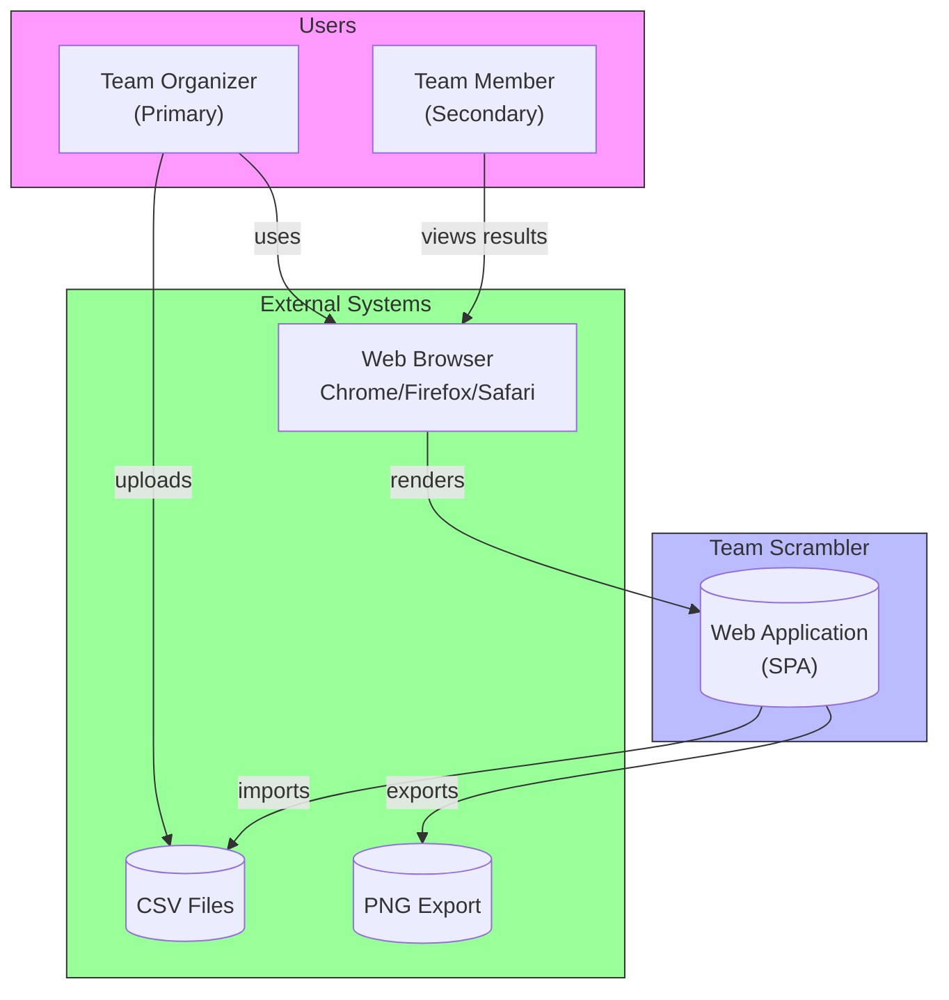
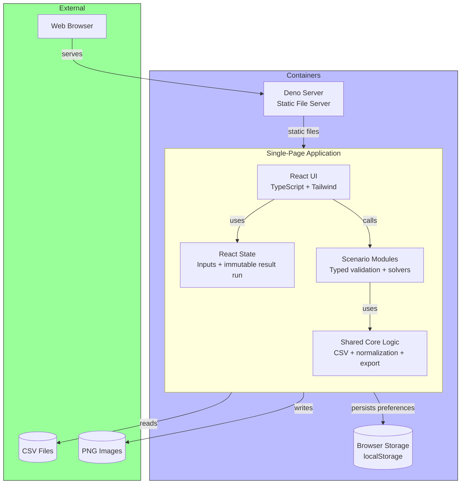
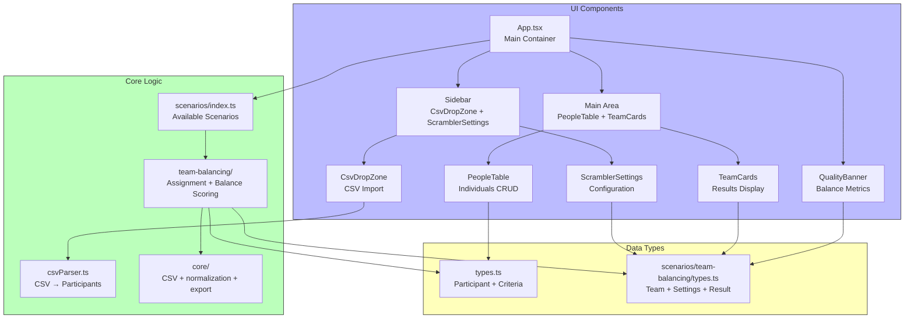
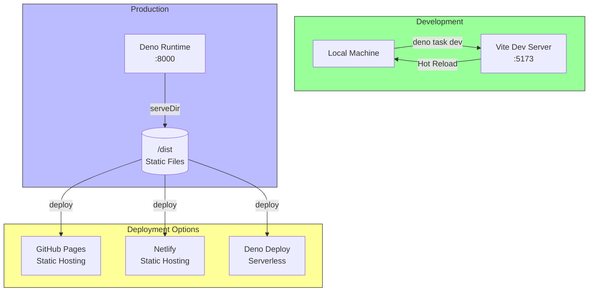

# Team Scrambler - Architecture Documentation (C4 Model)

This document describes the architecture of Team Scrambler using the **C4 Model**.

---

## C1: System Context Diagram



**Stakeholders:**

- **Primary**: Team organizers who upload CSV files and configure team distribution
- **Secondary**: Team members who view the results

**Scope:** Single-page web application running entirely in the browser. No server-side processing.

---

## C2: Container Diagram



| Container           | Technology                                  | Responsibility                                         | Persistence      |
| ------------------- | ------------------------------------------- | ------------------------------------------------------ | ---------------- |
| **SPA (Client)**    | React 19, TypeScript, Tailwind CSS, daisyui | User interface, CSV parsing, team scrambling algorithm | None (in-memory) |
| **Deno Server**     | Deno 2.x, @std/http                         | Serves static files from `/dist`                       | None             |
| **Browser Storage** | localStorage                                | Theme preference                                       | Persistent       |

---

## C3: Component Diagram (SPA)



### Component Responsibilities

| Component                   | File                               | Responsibility                                                       |
| --------------------------- | ---------------------------------- | -------------------------------------------------------------------- |
| **App**                     | `App.tsx`                          | Root presentation shell                                              |
| **useAppState**             | `hooks/useAppState.ts`             | Input state and immutable generated-result snapshots                 |
| **CsvDropZone**             | `components/CsvDropZone.tsx`       | Drag-and-drop CSV upload, parse errors                               |
| **PeopleTable**             | `components/PeopleTable.tsx`       | Display, edit, add, delete individuals                               |
| **ScramblerSettings**       | `components/ScramblerSettings.tsx` | Team size/count config, balance criteria selection                   |
| **TeamCards**               | `components/TeamCard.tsx`          | Visual team display, drag-and-drop reassign                          |
| **QualityBanner**           | `components/QualityBanner.tsx`     | Balance quality metrics and scoring                                  |
| **csvParser**               | `core/csvParser.ts`                | Parse CSV → participant objects, auto-detect columns                 |
| **shared core**             | `core/`                            | CSV parsing, value normalization, and safe CSV export                |
| **scenario registry**       | `scenarios/index.ts`               | Typed catalog of enabled grouping scenarios                          |
| **team-balancing scenario** | `scenarios/team-balancing/`        | Validate configuration, generate seeded teams, and calculate quality |
| **shared types**            | `types.ts`                         | Scenario-neutral participant and criterion types                     |

---

## C4: Code Diagram (Not Applicable)

The C4 model's Code level (class diagrams) is omitted for this project as the component structure is straightforward and the code is well-organized by feature.
The TypeScript type system provides sufficient structural documentation.

---

## Deployment View



### Deployment Options

| Environment            | Command           | Hosting                            |
| ---------------------- | ----------------- | ---------------------------------- |
| **Development**        | `deno task dev`   | Local Vite server on port 5173     |
| **Production Build**   | `deno task build` | Generates static files in `/dist`  |
| **Local Preview**      | `deno task serve` | Deno server on port 8000           |
| **Production Hosting** | Any static host   | GitHub Pages, Netlify, Deno Deploy |

---

## Data Flow

```mermaid
flowchart LR
    CSV -->|upload| CsvDropZone
    CsvDropZone -->|parse| CsvParser
    CsvParser -->|Participant[]| PeopleTable
    PeopleTable -->|display| UI
    
    ScramblerSettings -->|config| TeamScenario[Team-balancing scenario]
    PeopleTable -->|Participant[]| TeamScenario
    TeamScenario -->|versioned result snapshot| TeamCards
    TeamScenario -->|metrics| Quality
    Quality -->|scores| QualityBanner
    
    TeamCards -->|export| PNG
    TeamCards -->|export| CSV
```

---

## Technology Stack

| Layer          | Technology    | Version  | Purpose                       |
| -------------- | ------------- | -------- | ----------------------------- |
| **Runtime**    | Deno          | 2.x      | JavaScript/TypeScript runtime |
| **Framework**  | React         | 19.2.x   | UI component library          |
| **Language**   | TypeScript    | 5.x      | Type-safe JavaScript          |
| **Styling**    | Tailwind CSS  | 4.3.x    | Utility-first CSS             |
| **UI Library** | daisyUI       | 5.5.x    | Tailwind component library    |
| **Build Tool** | Vite          | 8.0.x    | Frontend tooling              |
| **Testing**    | Vitest        | 4.1.x    | Component testing             |
| **Testing**    | Deno Test     | built-in | Core logic testing            |
| **Icons**      | Lucide React  | 1.18.x   | Icon library                  |
| **Export**     | html-to-image | 1.11.x   | PNG export                    |

---

## Architecture Characteristics

| Characteristic         | Description                                                 |
| ---------------------- | ----------------------------------------------------------- |
| **Architecture Style** | Single-Page Application (SPA)                               |
| **Deployment Model**   | Static site (can run anywhere)                              |
| **State Management**   | React input state plus immutable generated-result snapshots |
| **Data Storage**       | In-memory (no server persistence)                           |
| **Routing**            | None; the current application has one screen                |
| **Offline Support**    | Browser cache only; no service worker guarantee             |
| **Responsiveness**     | Yes (mobile-first design)                                   |
| **Theming**            | Light/Dark mode via Tailwind                                |

---

## Related Documents

- [Algorithm Specification](ALGORITHM.md) - Technical details of the scrambling algorithm
- [ADRs](./adr/) - Architecture Decision Records
- [README](../README.md) - Project overview and usage
